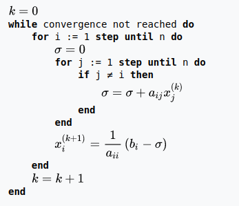

# FSO-ProcessosThreads
## Trabalhos sobre Processos e Threads

A solução de sistemas de equações lineares é o problema central da álgebra linear, sendo uma tarefa bastante recorrente em estudos nas mais diversas áreas, tais como a Física, Engenharia, Geometria e Probabilidade. Para resolver estes sistemas há diversos métodos, como por exemplo o Método de Gauss, Método da matriz inversa, Regra de Cramer e a fatoração LU.

Dentre os métodos disponíveis, o método de Jacobi é um dos métodos numéricos mais simples e fáceis de paralelizar, tornando-se atrativo para solução de sistemas de equações de grande porte. Dentro contexto, desenvolva uma versão paralela do método de Jacobi, utilizando criação de processos e área de memória compartilhada.  Faça testes avaliando o tempo de execução com matrizes de diferentes tamanhos e utilizando 1, 2, 3 e 4 processos. Por fim, avalie o desempenho do programa através do cálculo do speedup e da eficiência.

Posteriormente, reimplemente o programa utilizando a biblioteca de threads Pthreads.  Após, refaça os testes de tempo de execução com matrizes de diferentes tamanhos, utilizando 1, 2, 3 e 4 threads. Apresente os resultados através do  cálculo do speedup e da eficiência.
